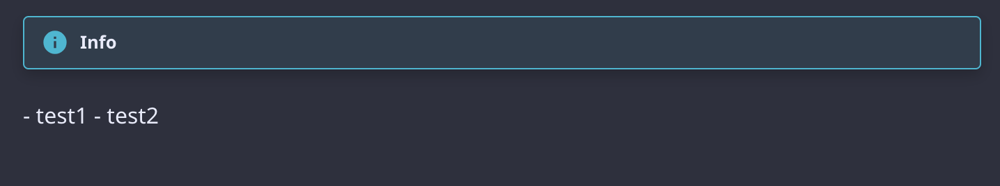
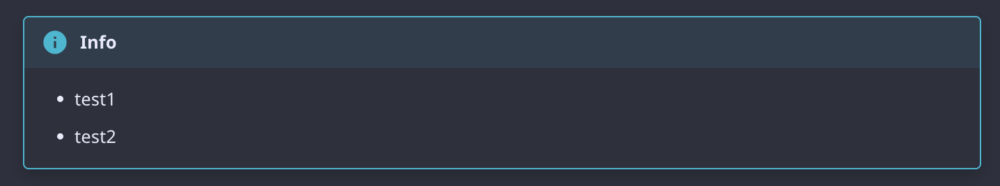

Mdformat is a proprietary Markdown formatter that can be used to apply a consistent style to Markdown files.<br/>
The code is written in python.

## Official Documents

[https://mdformat.readthedocs.io/en/stable/index.html](https://mdformat.readthedocs.io/en/stable/index.html)

## Installing

Please check [Installing](https://mdformat.readthedocs.io/en/stable/users/installation_and_usage.html#installing), I was able to install with pip,poetry,pre-commit.

## Usage

Please check [Command line usage](https://mdformat.readthedocs.io/en/stable/users/installation_and_usage.html#command-line-usage).

!!! info
    - When using the plug-ins described below, I could not figure out how to execute the commands independently.
    - Plugins could be run if [pre-commit hook](https://mdformat.readthedocs.io/en/stable/users/plugins.html#plugins).
    - From [Contributing](https://mdformat.readthedocs.io/en/stable/contributors/contributing.html#contributing), it seems that plug-ins need to be created with a pre-commit assumption.

### Specifying with pre-commit hook

If you specify `--check` as an argument, it is not executed until formatting, but until checking.
If you want to format, disable `--check`.

```yaml
  - repo: https://github.com/executablebooks/mdformat
    rev: 0.7.17
    hooks: mdformat
      - id: mdformat
        args: ["--check"].
        additional_dependencies: mdformat-admon
          - mdformat-admon
          - mdformat-footnote
          - mdformat-frontmatter
```

## Plugins

Please check [Plugins](https://mdformat.readthedocs.io/en/stable/users/plugins.html#plugins).

### Plugins used

#### mdformat-admon

mdformat plugin for [admonitions](https://squidfunk.github.io/mkdocs-material/reference/admonitions/#admonitions) in MkDocs.

As a background, I was using [mdformat](https://mdformat.readthedocs.io/en/stable/index.html) and found that it converts as follows.

##### Before conversion

```md
!!! info
    - test1
    - test2
```

##### After conversion

```md
!!! info
\- test1
\- test2
```

When "mkdocs serve" is executed, the display of admonitions is as follows.



This was not the intended display. I used mdformat-admon to resolve this situation.

Set up the hooks according to the official documentation.

```yaml
  - repo: https://github.com/executablebooks/mdformat
    rev: 0.7.17
    hooks:
      - id: mdformat
        additional_dependencies:
          - mdformat-admon
```

As a result, the intended display was confirmed without conversion by mdformat.



!!! info
    [The project page states](https://github.com/KyleKing/mdformat-admon#caveats) that as of 2023/08/12, only mkdocs are supported as follows<br/>
    In the future, they plan to support GitHub admonitions.<br/>
    > This plugin currently only supports admonitions that start with !!! ... and won't modify admonitions for Github, which should cover most use cases. Future work is planned for other types.
