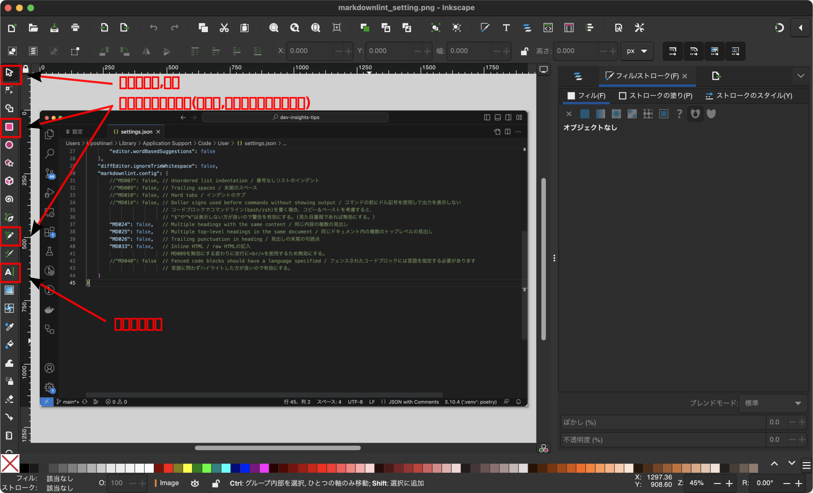
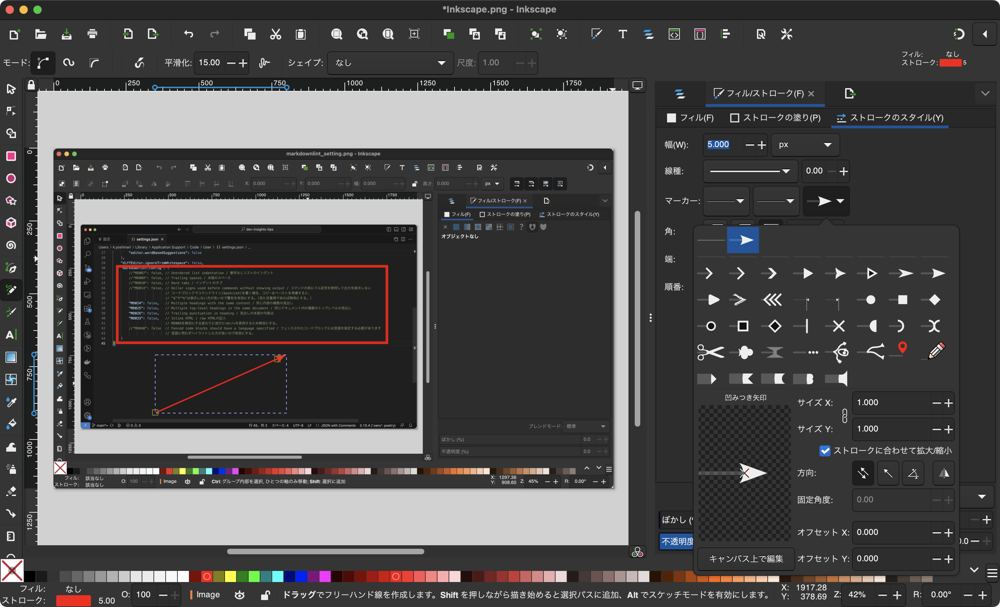
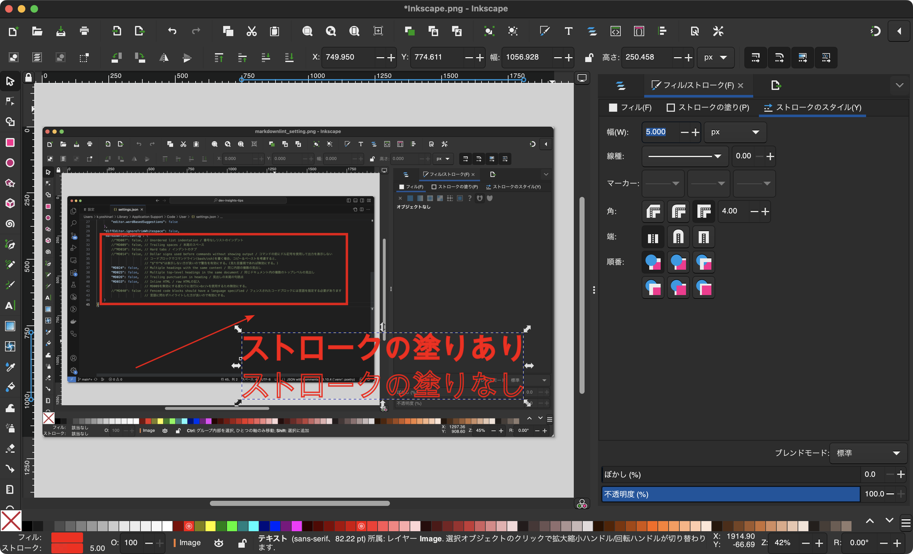

[Inkscape](https://inkscape.org/) is an open source vector graphics editor.

The application is available free of charge, runs on a variety of platforms (Windows, macOS, Linux, etc.), and offers extensive vector graphics creation and editing capabilities. It includes general drawing tools, path editing tools, text tools, shape tools, and more, and is used in a wide variety of projects.

Inkscape supports vector formats such as SVG (Scalable Vector Graphics) and is compatible with other vector graphics software. Plug-ins and extensions are available to extend its functionality.

The export function allows users to create PNGs, SVGs, and PDFs, making it easy to use.

### Usage

#### basic functionality

##### Short Shaped Figure No Fill

1. select the short form on the left
1. edit the border (change color)
   Select Fill and choose No Fill
   (Can also be done with None on the fill in the lower left corner of the screen)
1. fill
   Change the color in the stroke fill

##### Arrow symbol

1. Select the pencil tool
1. draw a line from the start point to the end point
1. change arrow style/size in Stroke Style

##### Input text

1. select the Text tool
1. enter text
1. in Stroke Fill/Style

