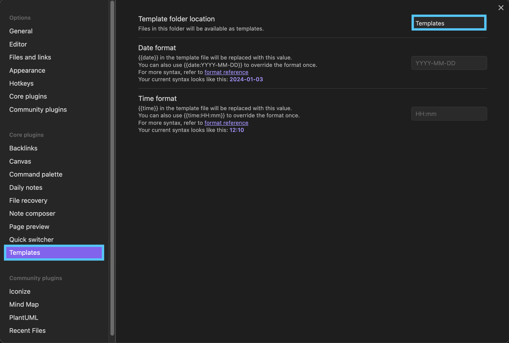
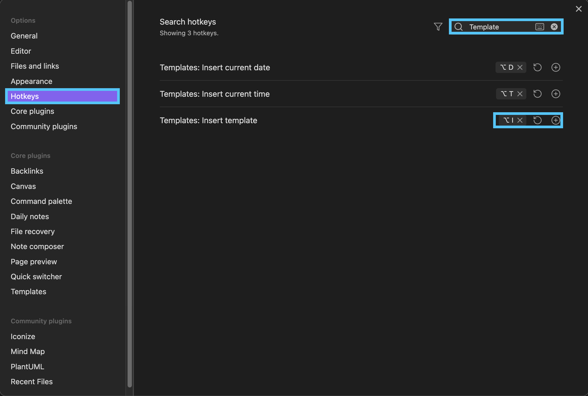

> It triggers the template prompt when creating a note.

[Back to Adding Plug-ins](../index.md/#adding-plug-ins)

## Usage

### Setting

!!! info
    - In order to use `Auto Template Trigger`, you must configure `Templates` from `Core plugins`.
    - The folder name specified in `Template folder location` can be any folder name.

### Related (Hotkeys setting)

You can select and execute `Template` by setting a shortcut key in `Hotkeys`.

