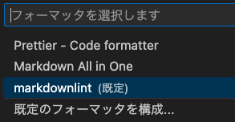

Extensions are presented by use.

## Creating a table of contents for markdown files (.md)

Use "Markdown All in One".

### Repository

[https://github.com/yzhang-gh/vscode-markdown](https://github.com/yzhang-gh/vscode-markdown)

### Usage

Launch the command palette and execute "Markdown All in One: Create Table of Contents (TOC)".

A table of contents (some parts are omitted) will be created as follows.

```bash
- [vscode](#vscode)
- [Table Of Contents](#table-of-contents)
- [拡張機能まとめ(用途別)](#拡張機能まとめ用途別)
- [マークダウンファイル(.md)の目次作成](#マークダウンファイルmdの目次作成)
```

By default, the title and table of contents are also output.<br />
In the settings, you can set a list of headings to be excluded from the table of contents (TOC) of the project file, but the wording changes from project to project, so it is not possible to set the wording? If regular expressions can be used, it may be possible, but I have not tested it yet.

```bash
Markdown › Extension › Toc: Omitted From Toc
```

If the title and table of contents are not needed, they can be deleted and lettered up.

In Windows:

- Decrease the level of indentation: "Ctrl+\]" or "Tab
- Increase the level of indentation: "Ctrl+\[" or "Tab+Shift

Or you can select a rectangle of text and adjust it.

Reference(Japanese： [VS Codeでテキストを矩形選択するには](https://atmarkit.itmedia.co.jp/ait/articles/1805/11/news022.html)

## Check marMarkdown syntax and style

Use "markdownlint".<br />
markdownlint is a VSCode extension that includes a library of rules that promote standards and consistency in Markdown files.

### Repository

[https://github.com/DavidAnson/vscode-markdownlint](https://github.com/DavidAnson/vscode-markdownlint)

### Usage

### Intentionally turn off Markdown check items

### Reference(Japanese): markdownlint Intentionally turning off Markdown check items

[(https://qiita.com/miriwo/items/132750876e37df26e976)](https://qiita.com/miriwo/items/132750876e37df26e976)

#### markdownlint Markdown checklist changes (settings.json)

```text
Enable Extensions > User > Markdownlint: Config (edit in settings.json)
```



If the default settings succeed, the following will be reflected in the user-specified `setting.json`. (The same applies for other languages)

```json
  "[markdown]": {
    "editor.defaultFormatter": "DavidAnson.vscode-markdownlint"
  },
```

If changed to `markdown-all-in-one` it will change.

```json
  "[markdown]": {
    "editor.defaultFormatter": "yzhang.markdown-all-in-one"
  },
```

#### Disabled markdownlint Markdown check items (markdownlint.config)

The settings used are as follows:

```json
    "markdownlint.config": {
        //"MD007": false, // Unordered list indentation / 番号なしリストのインデント
        //"MD009": false, // Trailing spaces / 末尾のスペース
        //"MD010": false, // Hard tabs / インデントのタブ
        //"MD014": false, // Dollar signs used before commands without showing output / コマンドの前にドル記号を使用して出力を表示しない
                          // When writing command line (bash/zsh) in code blocks, considering copy & paste,
                          // Enable the warning because it is better not to display "$" and "%". (Disable if appearance is important.)
        "MD024": false,   // Multiple headings with the same content / 同じ内容の複数の見出し
        "MD025": false,   // Multiple top-level headings in the same document / 同じドキュメント内の複数のトップレベルの見出し
        "MD026": false,   // Trailing punctuation in heading / 見出しの末尾の句読点
        "MD033": false,   // Inline HTML / raw HTMLの記入
                          // Disable MD009 because it uses <br/> for line breaks instead of disabling it.
        //"MD040": false  // Fenced code blocks should have a language specified / フェンスされたコードブロックには言語を指定する必要があります
                          // Code block highlighting is recommended.
    }
```

### Modify on a file-by-file basis

```text
Select all Markdown files > right click > Format Document...(the one with "..." under the two) > markdownlint
```

### Correct when saving the file.

```text
Select all Markdown files > Right click > Format Document... (the "..." under the two) > Default Formatter...Change
```

!!! info
    - If it does not run, check if `Editor: Format On Save` is enabled.
    - settigs.json: `"editor.formatOnSave": true,`

## Multilingual Oriented Formatter

markdownlint is a formatter for Markdown, but there is also an extension called [Prettier](https://prettier.io/) that supports html, javascript, etc.

## Usage

Similar to the use of markdownlint.

!!! info
    - The formate target includes Markdown, but there are a few cases where unintended conversions are not performed. (It may be possible to work around this depending on your settings, but this has not been confirmed.)
    - If you want to format Markdown files, markdownlint is a good choice.
