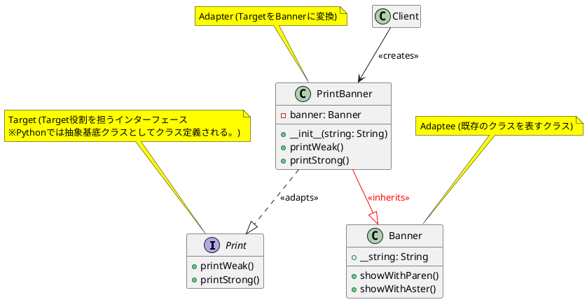

Render PlantUML Diagrams in Obsidian.

[Repository](https://github.com/joethei/obsidian-plantuml?tab=readme-ov-file#plantuml-support-for-obsidian)

[Back to Adding Plug-ins](../index.md/#adding-plug-ins)

```txt
@startuml
hide empty members

interface Print {
  + printWeak()
  + printStrong()
}
note top of Print #Yellow : Target (Target役割を担うインターフェース\n※Pythonでは抽象基底クラスとしてクラス定義される。)

class Banner {
  + __string: String
  + showWithParen()
  + showWithAster()
}
note top of Banner #Yellow : Adaptee (既存のクラスを表すクラス)

class PrintBanner {
  - banner: Banner
  + __init__(string: String)
  + printWeak()
  + printStrong()
}
note top of PrintBanner #Yellow : Adapter (TargetをBannerに変換)

Client --> PrintBanner : <<creates>>
PrintBanner ..|> Print : <<adapts>>
PrintBanner --|> Banner #line:red;text:red : <<inherits>>

@enduml
```


