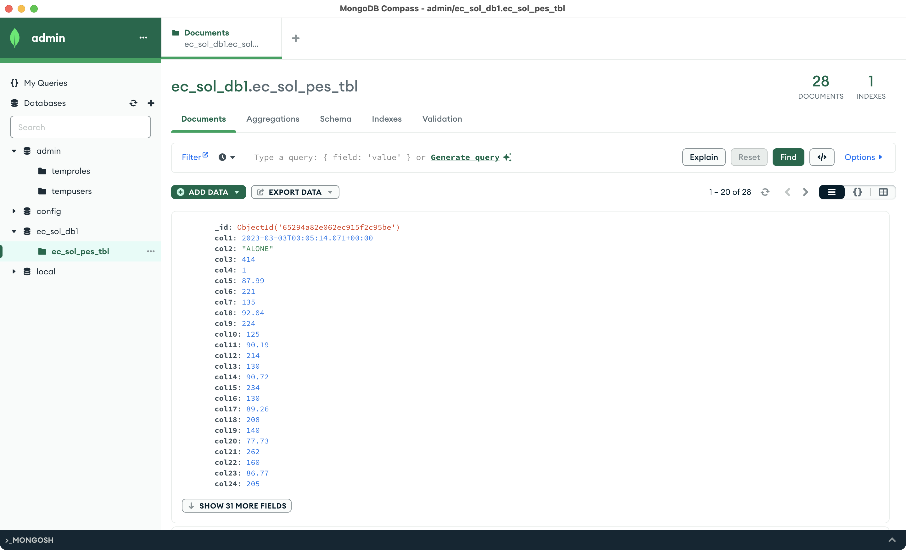

MongoDB Compassは、MongoDBのデータをビジュアルな環境でクエリ、集計、分析するためのGUIツールです。

!!! info

    公式ドキュメント: <https://www.mongodb.com/docs/compass/current/>

    > MongoDB Compass is a powerful GUI for querying, aggregating, and analyzing your MongoDB data in a visual environment.
    >
    > Compass is free to use and source available, and can be run on macOS, Windows, and Linux.



## インストール

### Mac向け

Macの場合はHomebrewからインストールすることが可能です。  
<https://formulae.brew.sh/cask/mongodb-compass>

??? infp "brew install --cask mongodb-compass"

    ```bash
    brew install --cask mongodb-compass
    ```

    ```bash
    ==> Downloading https://downloads.mongodb.com/compass/mongodb-compass-1.40.3-dar
    ######################################################################### 100.0%
    ==> Installing Cask mongodb-compass
    ==> Moving App 'MongoDB Compass.app' to '/Applications/MongoDB Compass.app'
    🍺  mongodb-compass was successfully installed!
    ```
