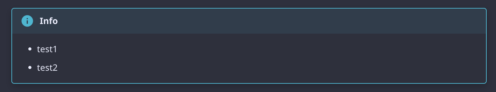

Mdformat は、Markdown ファイルに一貫したスタイルを適用するために使用できる、独自の Markdown フォーマッタです。<br/>
コードはpythonで作成されています。

## 公式ドキュメント

[https://mdformat.readthedocs.io/en/stable/index.html](https://mdformat.readthedocs.io/en/stable/index.html)

## インストール

[公式ドキュメント: Installing](https://mdformat.readthedocs.io/en/stable/users/installation_and_usage.html#installing)を確認してください。pip,poetry,pre-commitでインストールすることはできました。

## 使い方

[公式ドキュメント: Command line usage](https://mdformat.readthedocs.io/en/stable/users/installation_and_usage.html#command-line-usage)を確認してください。

!!! info
    - 後述するプラグインを使用する場合、コマンド単体では実行方法がわかりませんでした。
    - プラグインを使用する場合は[pre-commit hook](https://mdformat.readthedocs.io/en/stable/users/plugins.html#plugins)であれば実行できました。
    - [Contributing](https://mdformat.readthedocs.io/en/stable/contributors/contributing.html#contributing)からプラグインはpre-commit前提で作成する必要があるようです。

### pre-commit hookでの指定

引数に`--check`をつけるとフォーマットまで実行されずにチェックまで実行されます。
フォーマットする場合は`--check`の指定を無効にします。

```yaml
  - repo: https://github.com/executablebooks/mdformat
    rev: 0.7.17
    hooks:
      - id: mdformat
        args: ["--check"]
        additional_dependencies:
          - mdformat-admon
          - mdformat-footnote
          - mdformat-frontmatter
```

## プラグイン

[公式ドキュメント: Plugins](https://mdformat.readthedocs.io/en/stable/users/plugins.html#plugins)を参照してください。

### 使用したプラグイン

#### mdformat-admon

MkDocsの[admonitions](https://squidfunk.github.io/mkdocs-material/reference/admonitions/#admonitions)のためのmdformatプラグインです。

経緯として、[mdformat](https://mdformat.readthedocs.io/en/stable/index.html)を使用していたところ、以下のように変換されることがわかりました。

##### 変換前

```md
!!! info
    - test1
    - test2
```

##### 変換後

```md
!!! info
\- test1
\- test2
```

mkdocs serveを実行すると、admonitionsの表示は下記のようになります。


これは意図した表示ではありませんでした。この現状を解消するためにmdformat-admonを使用しました。

公式ドキュメントに従いフックを設定します。

```yaml
  - repo: https://github.com/executablebooks/mdformat
    rev: 0.7.17
    hooks:
      - id: mdformat
        additional_dependencies:
          - mdformat-admon
```

結果、mdformatによる変換は行われずに意図した表示を確認できました。



!!! info
    2023/08/12時点では以下の通りサポート対象はmkdocsのみとのことです。<br/>
    将来的にはGitHubのadmonitionsにも対応予定とのことです。<br/>
    > This plugin currently only supports admonitions that start with !!! ... and won't modify admonitions for Github, which should cover most use cases. Future work is planned for other types.
