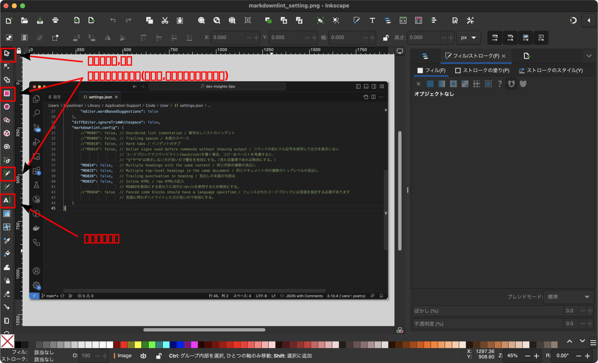
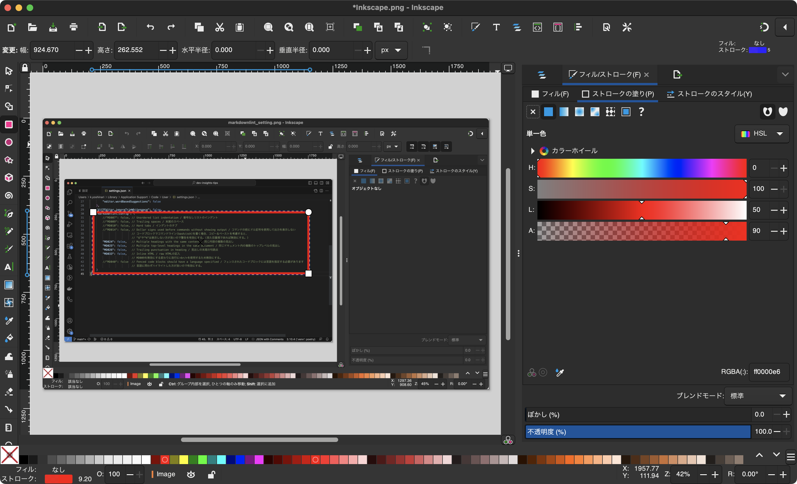
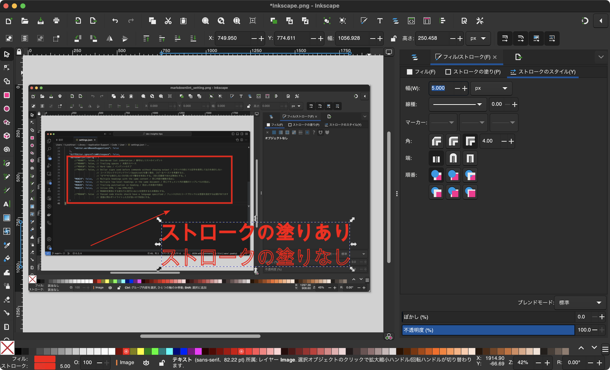

## Inkscape

[Inkscape](https://inkscape.org/ja/)はオープンソースのベクターグラフィックエディタです。

アプリケーションは無料で利用でき、さまざまなプラットフォーム（Windows、macOS、Linuxなど）で動作し、豊富なベクターグラフィックスの作成および編集機能を提供しています。一般的なドローイングツールやパス編集ツール、テキストツール、形状ツールなどが含まれており、さまざまなプロジェクトで利用されています。

InkscapeはSVG（Scalable Vector Graphics）などのベクターフォーマットに対応しており、他のベクターグラフィックスソフトウェアとの互換性も持っています。プラグインやエクステンションを利用して機能を拡張することもできます。

エクスポート機能を利用することで、PNG,SVG,PDFを作成できるため、使い勝手が良いです。

### 使用方法

#### 基本機能

##### 短形図形塗りつぶしなし

1. 左側の短形を選択
1. 枠線の編集(色の変更)
   フィルを選択し、塗りなしを選択する
   画面左下のフィル上のなしでも可能
1. 塗りつぶし
   ストロークの塗りで色を変更する

##### 矢印

1. 鉛筆ツールを選択
1. 始点から終点まで線を引く
1. ストロークのスタイルで矢印のスタイル/サイズを変更

##### テキスト

1. テキストツールを選択
1. テキスト入力
1. ストロークの塗り/スタイルで

