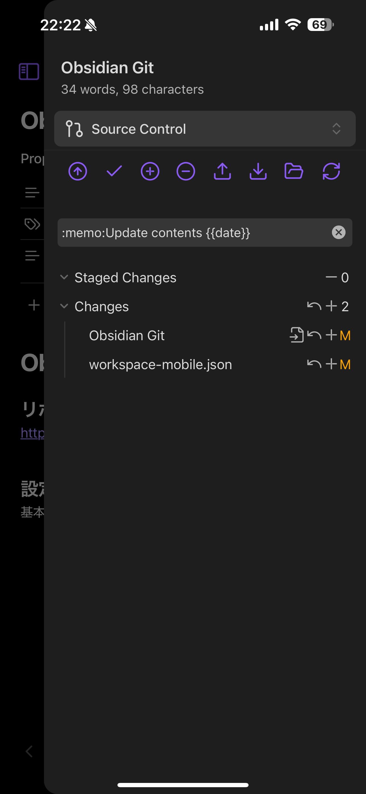
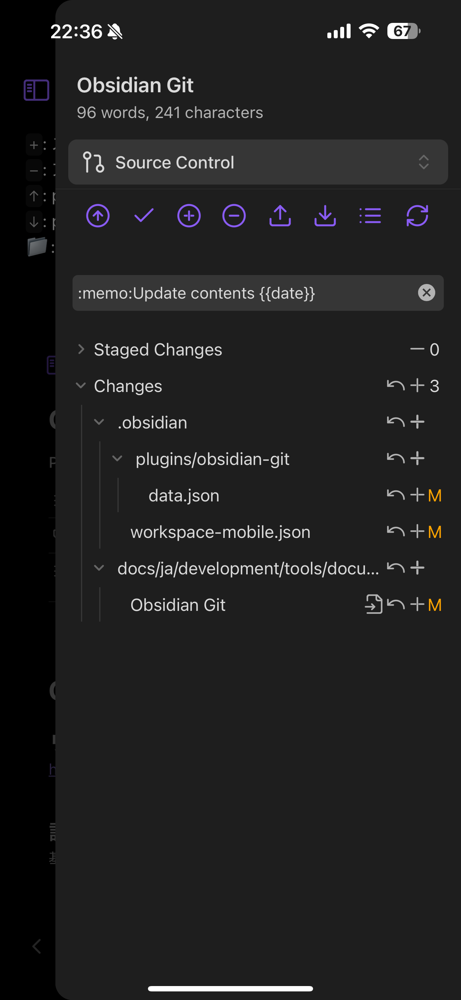

# Obsidian Gitとは

### リポジトリ

https://github.com/Vinzent03/obsidian-git

### 設定

基本的に設定はデフォルトのままで良い。
変更ファイルは右下の設定メニューから
`Open Git control view`から確認できる。

#### 操作

⬆️:stage&push
`+`: stage
`-`: upstage
`↑`: push
`↓`: pull
📁:フォルダレベルで差分を表示
`三`:ファイルレベルで差分を表示
🔄:ローカルファイルの更新？

