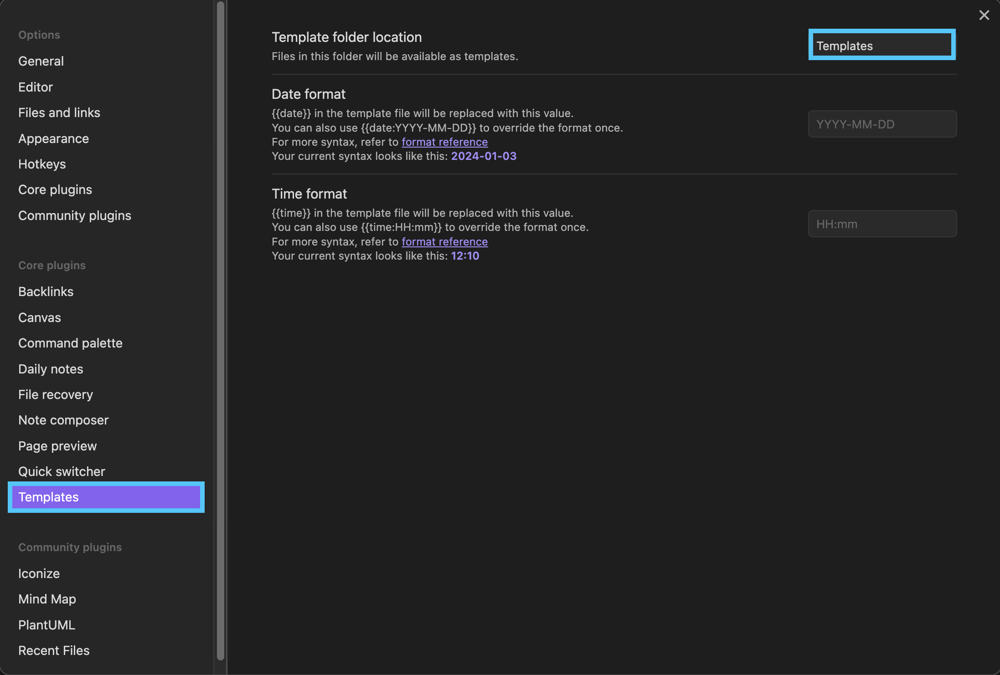
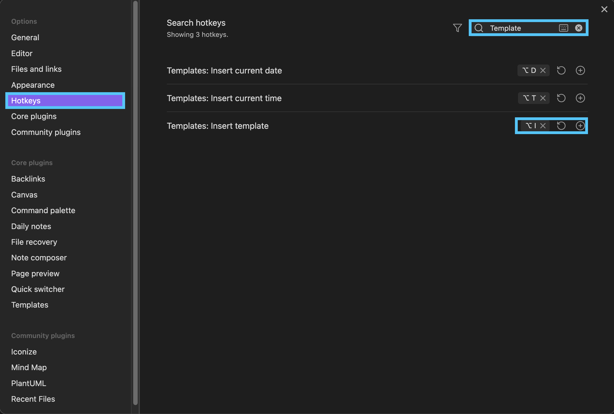

> It triggers the template prompt when creating a note.

[プラグイン一覧へ戻る](../index.md#プラグインの追加)

## 使い方

### 設定

!!! info
    - `Auto Template Trigger`を使用するためには`Core plugins`から`Templates`の設定が必要です。
    - `Template folder location`で指定するフォルダ名は任意のフォルダ名を指定できます。

### 関連(Hotkeys設定)

`Hotkeys`でショートカットキーを設定することで`Template`を選択、実行することができます。

